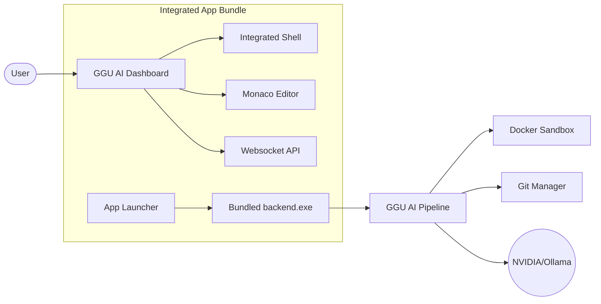

# ⚡ GGU AI 2026 – Autonomous CI/CD Healing Agent

<p align="center">
  
  
  
  
</p>

> **Transform CI/CD from a failure point into a self-healing pipeline.**   
>GGU AI 2026 is an autonomous desktop workspace that clones repositories, discovers test failures, generates LLM-powered fixes, and integrates a full developer environment—all in **one single app**.

---

## 🚀 The "One-Click" Experience

We have fully unified the stack into a premium Windows application. No more juggling 3 terminals.

### 📦 Quick Start: Generate the Integrated App
Run the automated build script to create your standalone `.exe`:
```powershell
.\build_integrated_app.bat
```
**This script automates the magic:**
1. ⚛️ **React Frontend**: Compiles into optimized production assets.
2. 🐍 **Python Backend**: Bundles a standalone `backend.exe` via PyInstaller.
3. 🌐 **Electron Shell**: Packages everything into a single **Setup Installer** and a **Portable EXE**.

**Find your app here:** `electron-app/dist/GGU AI CI-CD Healing Agent Setup 1.0.0.exe`

---

## 🔥 Key Features

### 🛠️ Integrated Developer Workspace
- **Smart Integrated Terminal**: A high-performance terminal that automatically locks into your project directory—works flawlessly for **both Local Folders and GitHub Repositories**.
- **Monaco Code Editor**: The same engine that powers VS Code. View, edit, and verify AI-applied fixes directly in the app.
- **Dynamic File Tree**: Navigate your project, create new files, or folders with intuitive controls.

### 🤖 GGU AI Autonomous Agent
- **Self-Healing Pipeline**: Automatically detects failures, classifies bugs (LINT, SYNTAX, LOGIC), and generates patches.
- **Autonomous Creator**: Ask the AI in the chat to create new components; it writes the code and saves it directly to your workspace.
- **Iterative Verification**: The agent doesn't just guess; it runs tests, checks results, and iterates until the code is green.

### 🏗️ Advanced App Infrastructure
- **Zero-Config Startup**: Automatically initializes your `.env` from templates.
- **Production-Ready storage**: Uses Windows `AppData` for DB and clones, ensuring it runs perfectly even when installed in restricted folders.
- **Intelligent Health-Check**: The UI waits for the backend to "wake up" before showing you the dashboard—no more `ECONNREFUSED` errors.

---

## 📖 Architecture



---

## 💻 Manual Developer Mode

If you're hacking on the core agents themselves:

**Backend Setup:**
```bash
cd backend
python -m venv .venv && .venv\Scripts\activate
pip install -r requirements.txt
python run_backend.py
```

**Frontend & Desktop Setup:**
```bash
cd electron-app
npm install && npm run dev
```

---

## ⚙️ Configuration (Settings)

Manage your environment via the in-app **Settings** modal:
- **GITHUB_PAT**: Required for cloning private repos and pushing fixes.
- **NVIDIA_API_KEY**: Powers the high-precision fix generation.
- **Ollama**: Connect to local models for offline processing.

---

## 🏆 Team GGU AI 

| Member | Focus |
| :--- | :--- |
| **Saiyam Kumar** | Team Leader & Integration Architect |
| **GGU AI ORGANISERS** | Autonomous Agent Development |

---

## 📜 License
Distributed under the MIT License. © 2026 GGU AI ORGANISERS.

