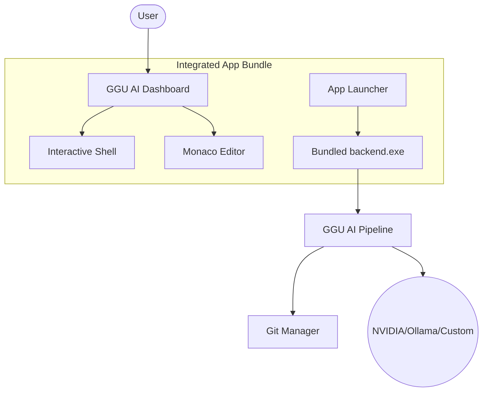

# ⚡ GGU AI 2026 – Autonomous CI/CD Healing Agent

<p align="center">
  
  
  
  
</p>


> **Transform CI/CD from a failure point into a self-healing pipeline.**   
> GGU AI 2026 is an autonomous desktop workspace that clones repositories, discovers test failures, generates LLM-powered fixes, and integrates a full developer environment—all in **one single app**.

---

## 🚀 The "One-Click" Experience

We have fully unified the stack into a premium Windows application. No more juggling terminal windows.

### 📦 Quick Start: Generate the Integrated App
Run the automated build script to create your standalone `.exe`:
```powershell
.\build_integrated_app.bat
```
**This script automates the magic:**
1. ⚛️ **React Frontend**: Compiles into optimized production assets.
2. 🐍 **Python Backend**: Bundles a standalone `backend.exe` via PyInstaller.
3. 🌐 **Electron Shell**: Packages everything into a single **Setup Installer** and a **Portable EXE**.

---

## 🔥 Key Features

### 🛠️ Interactive Developer Workspace
- **Smart Terminal 2.0**: Bidirectional communication with support for interactive inputs (e.g., `flutter run`).
- **Enhanced UI Controls**: Minimize, maximize, and resizable terminal window with clickable file paths.
- **Monaco Code Editor**: Professional-grade editor for viewing and editing AI-applied fixes.


### 🤖 GGU AI Autonomous Agent
- **Self-Healing Pipeline**: Automatically detects failures, classifies bugs, and applies precise patches.
- **Custom LLM Profiles**: Configure your own LLM settings (OpenAI, NVIDIA, Ollama) directly in the chat header.
- **TypeWriter UI**: Fluid animation for AI responses with automatic scrolling for long outputs.


### 🏗️ Advanced App Infrastructure
- **Usage Tracking & Limits**: Built-in monitoring for testing minutes (e.g., 20m/day, 200m total per app) to optimize resources.
- **Media Playback**: Support for playing audio/video files directly within the workspace.
- **Admin Management**: Dedicated panel for configuring app assets (like About Us branding).


---

## 📖 Architecture



---

## 💻 Manual Developer Mode

**Backend Setup:**
```bash
cd backend
python -m venv .venv && .venv\Scripts\activate
pip install -r requirements.txt
python run_backend.py
```

**Frontend & Desktop Setup:**
```bash
cd electron-app
npm install && npm run dev
```

---

## 📜 License
Distributed under the MIT License. © 2026 GGU AI.


