# 💥 GGU AI – The Ultimate Autonomous CI/CD Healing Agent

<p align="center">
  
  
  
  
  
  
</p>


> **Transform CI/CD from a failure point into a self-healing pipeline. Built personally by the one and only GGU AI.**  
> GGU AI is an unprecedented, autonomous desktop workspace that clones repositories, discovers test failures, generates LLM-powered fixes, and integrates a full top-tier developer environment — all packaged flawlessly in **one single Windows `.exe`**. This masterpiece scales to handle everything!

---

## 📦 Download & Run (No Setup Required)

Choose the build that suits you best from `electron-app/dist/`:

| File | Size | Type | Description |
|------|------|------|-------------|
| 🖥️ `GGU AI CI-CD Healing Agent 1.0.0.exe` | ~96 MB | **Portable** | Run directly — no installation needed |
| 📦 `GGU AI CI-CD Healing Agent Setup 1.0.0.exe` | ~96 MB | **NSIS Installer** | Installs to Program Files with a Start Menu shortcut |

> **First run**: On first launch, the app will auto-copy `.env.example` → `.env` in the bundled backend directory. Open Settings to add your API keys.

---

## 🚀 One-Click Build (Rebuild from Source)

To regenerate fresh EXEs from the latest source code, run the three-step build pipeline:

```powershell
# From the project root
npm run build:frontend   # Step 1: Compile React app → frontend-react/build/
npm run build:backend    # Step 2: PyInstaller → backend/dist/backend.exe
npm run build:electron   # Step 3: electron-builder → electron-app/dist/*.exe
```

Or run the legacy batch helper:
```powershell
.\build_integrated_app.bat
```

### What Each Step Produces

| Step | Command | Output |
|------|---------|--------|
| ⚛️ React Frontend | `npm run build:frontend` | `frontend-react/build/` (~197 kB gzipped JS) |
| 🐍 Python Backend | `npm run build:backend` | `backend/dist/backend.exe` (~23 MB, PyInstaller one-file) |
| 🌐 Electron App | `npm run build:electron` | `electron-app/dist/` — Portable EXE + NSIS Installer |

> **Backend build uses**: PyInstaller 6.19.0 · Python 3.14.2 · Windows-64bit  
> **Electron build uses**: electron-builder 24.13.3 · Electron 30.5.1 · NSIS · x64

---

## 🔥 Key Features

### 🤖 Autonomous CI/CD Healing Agent
- **Self-Healing Pipeline**: Automatically detects failures, classifies bugs, and applies precise patches.
- **Deep Iterative Resolution**: Agent can run up to 30 continuous fix-and-test iterations per loop.
- **Smart Remediation**: Agent reads code and implicitly maps the repo folder structure (supports file & folder creation).
- **Inline Error Feedback**: Validation errors are logged directly as inline comments (`# FAILED`) inside your code for ultimate clarity.
- **Multi-LLM Support**: Configure OpenAI, NVIDIA NIM, or Ollama directly from the UI.
- **TypeWriter UI**: Fluid animation for AI responses with automatic scrolling.

### 🛠️ Interactive Developer Workspace
- **Smart Terminal**: Bidirectional WebSocket terminal — supports interactive inputs like `flutter run`.
- **Monaco Code Editor**: Professional-grade editor for viewing and editing AI-applied fixes.
- **Clickable File Paths**: Terminal output file paths open directly in the editor.
- **Theme Support**: Custom visual themes including default, Black, White, and Chackers Green.
- **Dual Chat Modes**: Choose between *Plan Mode* (analytical) and *Fast Mode* (rapid execution) for agent behavior.

### 📊 Project Intelligence
- **Usage Tracking & Limits**: Built-in monitoring — 20 min/day, 200 min total per app.
- **Results Generator**: Automated test result parsing and structured scoring.


---

## 📖 Architecture

```mermaid
graph TD
    User([User]) --> UI[GGU AI Dashboard]
    subgraph Electron Desktop Bundle
        UI --> Terminal[Interactive WebSocket Shell]
        UI --> Editor[Monaco Code Editor]
        Launcher[App Launcher] --> Backend[Bundled backend.exe]
    end
    Backend --> Agent[CI/CD Healing Agent]
    Agent --> Git[Git Manager / GitPython]
    Agent --> Docker[Docker Runner]
    Agent --> LLM((NVIDIA / OpenAI / Ollama))
    Agent --> DB[(SQLite · chat_history.db)]
```



---

## 💻 Manual Developer Mode

### Backend
```bash
cd backend
python -m venv .venv && .venv\Scripts\activate
pip install -r requirements.txt
python run_backend.py
# → FastAPI server running at http://127.0.0.1:8000
```

### Frontend (React Dev Server)
```bash
cd frontend-react
npm install && npm start
# → React dev server at http://localhost:3000
```

### Electron (Desktop Shell)
```bash
cd electron-app
npm install && npm run dev
# → Electron loads React from localhost:3000 in dev mode
```

---

## 🔧 Backend Dependencies

| Package | Purpose |
|---------|---------|
| `fastapi >= 0.110.0` | REST & WebSocket API |
| `uvicorn[standard] >= 0.29.0` | ASGI server |
| `gitpython >= 3.1.40` | Git clone & management |
| `docker >= 7.0.0` | Container-based test runner |
| `pytest >= 8.0.0` | Test discovery & execution |
| `pydantic >= 2.5.0` | Data validation |
| `openai >= 1.30.0` | NVIDIA / OpenAI LLM client |
| `python-dotenv >= 1.0.0` | Environment variable loading |

---

## 🗂️ Project Structure

```
CICD_AA/
├── backend/                  # Python FastAPI backend
│   ├── main.py               # API routes & WebSocket handlers
│   ├── agents.py             # Autonomous CI/CD healing logic
│   ├── git_utils.py          # Repository cloning & diffing
│   ├── docker_runner.py      # Containerized test execution
│   ├── llm_client.py         # Multi-LLM abstraction layer
│   ├── results_generator.py  # Test result parsing & scoring
│   ├── run_backend.py        # Uvicorn entrypoint (PyInstaller target)
│   ├── requirements.txt      # Python dependencies
│   └── dist/backend.exe      # ← Built backend binary (~23 MB)
├── frontend-react/           # React 18 frontend
│   ├── src/                  # Components, App.js, index.css
│   └── build/                # ← Compiled production assets
├── electron-app/             # Electron desktop shell
│   ├── main.js               # Main process — spawns backend, creates window
│   ├── preload.js            # Context bridge (IPC)
│   └── dist/                 # ← Final EXEs (Portable + Setup Installer)
│       ├── GGU AI CI-CD Healing Agent 1.0.0.exe          (~96 MB)
│       └── GGU AI CI-CD Healing Agent Setup 1.0.0.exe    (~96 MB)
├── package.json              # Root build scripts
└── build_integrated_app.bat  # Legacy one-click build script
```

---

## 📜 License

Distributed under the **MIT License**. © 2026 Crafted by hand by GGU AI.
